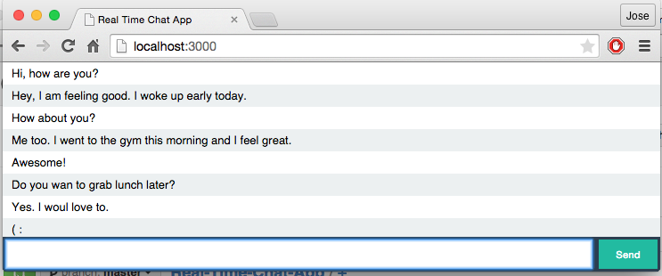

# Real Time Chat App using Node, Express, and Socket.io

<h2>Instructions</2>

<h2>You need these dependencies to build the App</2>
<ul>
<li>Node.js</li>
<li>Express</li>
<li>Socket.io</li>
</ul>
<h3> Screenshot </h3>


<h4>First let’s create a package.json </h4>

package.json
``` json
{
  "name": "RealTimeChatApp",
  "version": "0.0.1",
  "author": "tizol",
  "description": "Real time chat using Node and socket.io",
  "dependencies": {
  
  }
}
```
<h4>To install the dependencies, we’ll use npm: Node Package Manager<h4>

    $ npm install --save express@4.10.3
    $ npm install --save socket.io

app.js for the back-end
``` javascript
// require your dependencies
// your App is ABSOLUTELY DEPENDANT ON YOUR DEPENDENCIES
var app = require('express')();
var http = require('http').Server(app);
var io = require('socket.io')(http);

// Make an HTTP Request
// Hyper Text Transfer Protocol
// respond by sending a file (e.i html)
app.get('/', function(req, res){
  res.sendFile(__dirname + '/index.html');
});

// listen to events using Socket.io
// handle events with callback functions
io.on('connection', function(socket){
  console.log( 'a user connected' );

  socket.on('chat message', function(msg){
    io.emit('chat message', msg);
  });
});

// Your App is listening on port 3000
http.listen(3000, function(){
  console.log( 'listen on: localhost:3000' );
});
```

index.js for the front-end
``` javascript
var socket = io();
    $('form').submit(function(){
      socket.emit('chat message', $('#m').val() );
      $('#m').val('');
      return false;
    });
    socket.on('chat message', function(msg){
      $("#messages").append($('<li>').text(msg));
    });

```


    

